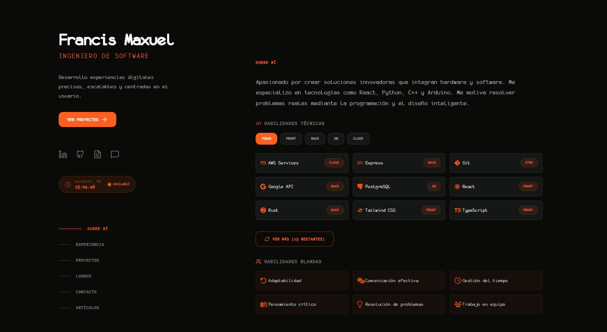

# Portafolio — Francis Maxuel Urquizo Oré

[English version](README_EN.md)

Portafolio personal moderno y responsivo para presentar proyectos, experiencia, habilidades, certificaciones, premios y artículos. La interfaz está construida con React y los datos dinámicos se obtienen desde Supabase.



## Características

- Página principal con perfil, proyectos, experiencia, habilidades, logros y contacto.
- Páginas de detalle para proyectos y experiencia.
- Blog con contenido Markdown y compatibilidad con GitHub Flavored Markdown.
- Filtros, tarjetas interactivas, cursor personalizado y transiciones con GSAP.
- Estado de disponibilidad calculado con la zona horaria de Lima.
- Datos almacenados en Supabase y caché de sesión para reducir consultas repetidas.
- Diseño responsive con Tailwind CSS 4 y estilos personalizados.
- Despliegue automatizado en GitHub Pages.

## Tecnologías

- React 19 y React Router 7
- Vite 6
- Tailwind CSS 4
- Supabase
- GSAP
- Lucide React
- React Markdown y Remark GFM
- ESLint 9

## Requisitos

- Node.js 20 o superior
- npm
- Un proyecto de Supabase con los datos del portafolio

## Instalación

```bash
git clone https://github.com/UmbraFlare-code/Portafolio.git
cd Portafolio
npm install
```

Copia las variables de entorno de ejemplo y completa las credenciales públicas de Supabase:

```bash
cp .env.example .env
```

```env
VITE_SUPABASE_URL=https://tu-proyecto.supabase.co
VITE_SUPABASE_PUBLISHABLE_KEY=tu-clave-publicable
```

> Las variables con el prefijo `VITE_` se incluyen en el cliente. Usa únicamente la clave publicable de Supabase y protege los datos mediante Row Level Security (RLS).

Inicia el servidor de desarrollo:

```bash
npm run dev
```

## Scripts disponibles

| Comando | Descripción |
| --- | --- |
| `npm run dev` | Inicia Vite en modo desarrollo. |
| `npm run build` | Genera la versión de producción en `dist/`. |
| `npm run preview` | Sirve localmente la compilación de producción. |
| `npm run lint` | Ejecuta ESLint en el proyecto. |

## Estructura del proyecto

```text
Portafolio/
├── public/               # Imágenes, iconos y fuentes
├── src/
│   ├── components/       # Componentes reutilizables
│   ├── data/             # Configuración local del perfil
│   ├── layouts/          # Layouts principales
│   ├── lib/              # Cliente de Supabase
│   ├── pages/            # Páginas y rutas de detalle
│   ├── sections/         # Secciones de la página principal
│   ├── services/         # Consultas, adaptadores y caché de datos
│   └── styles/           # Estilos globales
├── .github/workflows/    # Despliegue y mantenimiento de Supabase
└── vite.config.js
```

## Despliegue

El workflow de GitHub Pages se ejecuta al enviar cambios a la rama `workflow-web`. Antes de desplegar, configura estos secretos en GitHub:

- `VITE_SUPABASE_URL`
- `VITE_SUPABASE_PUBLISHABLE_KEY`

Vite usa `/Portafolio/` como ruta base. Si publicas el proyecto con otro nombre o dominio, actualiza `base` en `vite.config.js`.

## Licencia

Distribuido bajo la licencia MIT. Consulta [LICENSE](LICENSE).

## Contacto

- [LinkedIn](https://linkedin.com/in/maxuel-urquizo-or%C3%A9-2ba4b1279)
- [GitHub](https://github.com/UmbraFlare-code)
- [Portafolio](https://umbraflare-code.github.io/Portafolio/)
- [Currículum](https://rxresu.me/umbraflare-code/cv)
- Email: umaxuel@gmail.com
